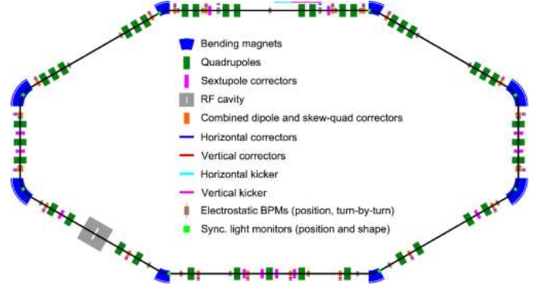

<H1> Synergia Iota Simulations </H1>

     

Pictured above is the IOTA lattice. The current lattice file does not have an RF Cavity nor sextupoles as depicted in the picture.

<H3> Synergia Resources </H3>
Synergia documentation and source: https://cdcvs.fnal.gov/redmine/projects/synergia2/wiki/Wiki
Computing resources with Synergia prebuilt: https://jupyter.radiasoft.com
Can run in parallel using mpirun

<H3> IOTA_Elens.py </H3>
IOTA simulation with an Electron lens lattice element. this is a simple lattice with no non linear elements besides the electron lens.

<H3> IOTA_opts.py </H3>
An options file containing parameters for the IOTA simulation. There are 3 main sections: beam options, simulation options, and electron lens options.

<H3> plotify.py </H3>

 Plots the output from running the simulations. This will create graphs for emittance and rms. 

 Usage: python plotify.py &lt;diagnostic file&gt; &lt;diagnostic file&gt; 

<H4> To Do: </H4>
- Gather Results
